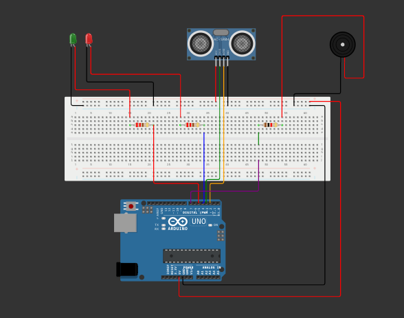

# redzone 🚨
RedZone est un projet Arduino de détection de proximité avec alarme sonore et visuelle, basé sur le capteur HC-SR04.

> Un projet Arduino simple et efficace pour détecter les objets à proximité avec alerte visuelle (LED) et sonore (buzzer). Développé et testé avec [Wokwi](https://wokwi.com).
---

## 🎯 Objectif

Le système **RedZone** utilise un capteur ultrasonique HC-SR04 pour mesurer la distance d’un objet :
- Si un objet est détecté à **20 cm ou moins**, une **LED rouge** s’allume et un **buzzer** émet un son.
- Sinon, une **LED verte** reste allumée pour signaler que tout est normal.

---

## 🧰 Matériel utilisé

- 1 × Arduino Uno
- 1 × Capteur Ultrasonique HC-SR04
- 1 × LED Rouge
- 1 × LED Verte
- 1 × Résistances (220Ω)
- 1 × Buzzer
- Câbles de connexion
- Breadboard

---

## 🔌 Schéma de câblage



> Le fichier `diagram.json` contient les informations détaillées du montage (généré via Wokwi).

---

## 🔢 Fichiers du projet

| Fichier                              | Description                      |
|--------------------------------------|----------------------------------|
| `sketch.ino`                         | Code Arduino                     |
| `diagram.json`                       | Schéma du circuit Wokwi          |
| `wokwi-project.txt`                  | Lien vers la simulation en ligne |
| `redzone-arduino-schema-montage.png` | Capture visuelle du montage      |

---

## ▶️ Simulation en ligne

Tu peux tester ce projet directement ici :  
👉 [Lien vers la simulation Wokwi](https://wokwi.com/projects/428144827576776705)

---

---

## 🔁 Clonage et utilisation

```bash
git clone https://github.com/nanaelie/redzone.git
cd redzone
```
## 📜 Licence

Ce projet est open-source et libre d'utilisation à des fins pédagogiques et personnelles. 😉

---
